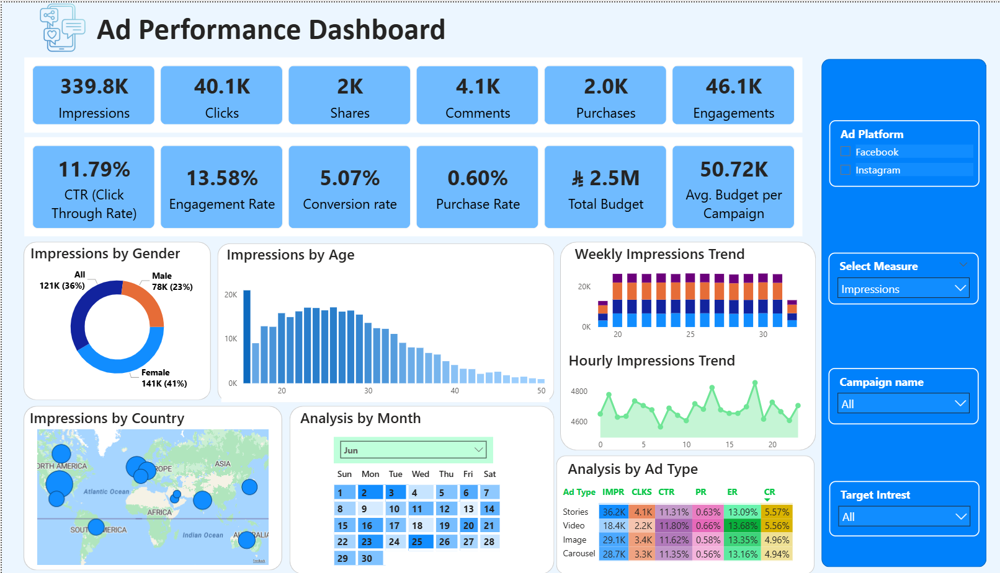
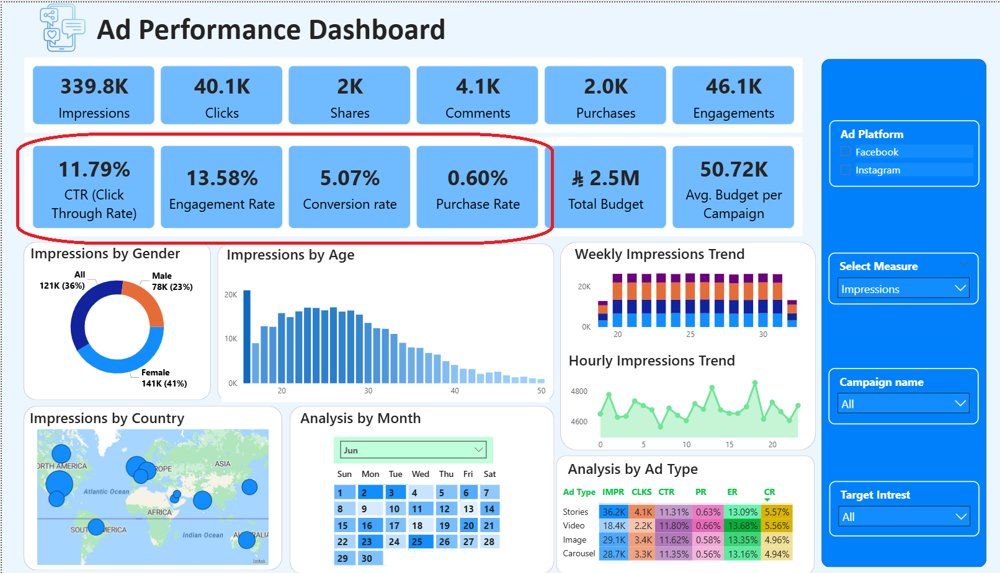

# Ads & Conversion Optimization Dashboard | Power BI

## Project Overview

This project presents an **E-Commerce & Marketing Analytics Dashboard** developed using Microsoft Power BI to analyze multi-channel advertising campaigns, identify user journey bottlenecks, and solve a critical conversion paradox.

The dashboard is based on campaign data as of **August 2026**. All metrics reflect performance tracking up to this reporting date.

---

## Dashboard Structure

The dashboard consists of two main pages:

* **Campaign Performance & Engagement** - evaluates audience reach, creative performance, and engagement benchmarks.
* **Conversion Funnel & Drop-Off Analysis** - maps the user journey from initial click to final purchase to identify revenue leaks.

---

# 01 — Campaign Performance & Engagement

The Campaign Performance page provides a high-level snapshot of user interactions, creative efficiency, and audience engagement across multi-channel social advertising campaigns.

### Key KPIs

* **Total Interactions:** 400K+
* **Unique Users:** 10.4K
* **Click-Through Rate (CTR):** 11.79%
* **Engagement Rate:** 13.58%
* **Purchase Conversion Rate:** 0.61%

### The Conversion Paradox

While creative content drastically outperformed industry standards (with an **11.79% CTR** vs. the ~1-2% benchmark and a **13.56% Engagement Rate** vs. ~1-3%), severe friction in the post-click pipeline choked final purchases down to **0.60%**.

### Engagement by Channel & Demographics

The dashboard highlights:
* High volume of initial interactions coming from mobile and social placements.
* Strong user responsiveness to visual creative assets, proving high top-of-funnel interest.

---

# 02 — Conversion Funnel & Drop-Off Analysis

This page focuses on the post-click pipeline, tracking user drop-offs at each stage of the funnel to locate exact revenue leaks and optimization opportunities.

### Key Insights & Funnel Bottlenecks

* **Top-of-Funnel (Impressions & Clicks):** Exceptionally healthy, driven by high-performing creative copy and visuals.
* **Mid-Funnel (Landing Page & Product Interaction):** Significant drop-off detected post-click, indicating poor user experience or slow page load speeds.
* **Bottom-of-Funnel (Checkout & Purchase):** Friction points at the final checkout step, resulting in the low **0.61% purchase conversion rate**.

### Strategic Business Recommendations

* **Eliminate Revenue Leaks:** Streamline the landing page checkout process to recover dropping users.
* **Optimize Landing Page Experience:** Redesign mobile UX to reduce friction between click and cart.
* **Budget Reallocation:** Shift marketing spend away from unoptimized landing paths and reinvest in high-converting segments.

---

# Data Quality Observations

As part of the exploratory data analysis, the underlying dataset was reviewed for consistency to ensure realistic business insights. 

* **Demographic Distributions:** Filtered out unrealistic outlier age groups to align with active digital buyer personas.
* **Pipeline Integrity:** Validated multi-table relationships to ensure accurate tracking from pre-click impressions to final purchase events.

---

# Tools & Skills

* Microsoft Power BI
* Data Analysis & Visualization
* Conversion Rate Optimization (CRO)
* Marketing Funnel Analytics
* SQL (Data Cleansing & Modeling)
* Executive Reporting

---

## Project Highlights

This project demonstrates the use of Power BI and data analytics to:

* Uncover and diagnose complex pre-to-post-click funnel paradoxes.
* Build interactive executive dashboards tracking key marketing KPIs.
* Identify customer journey bottlenecks and eliminate revenue leaks.
* Translate raw advertising data into actionable budgeting and UX strategies.
